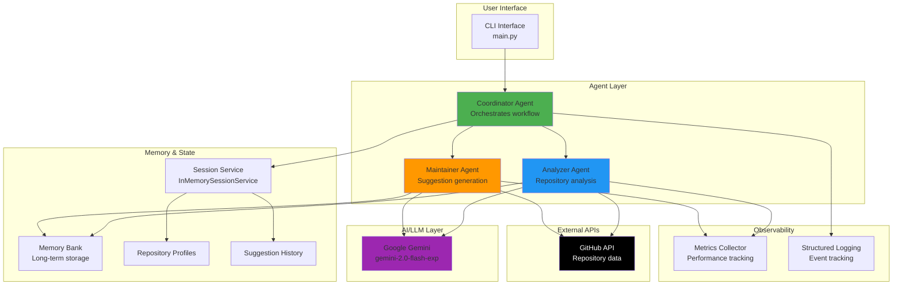
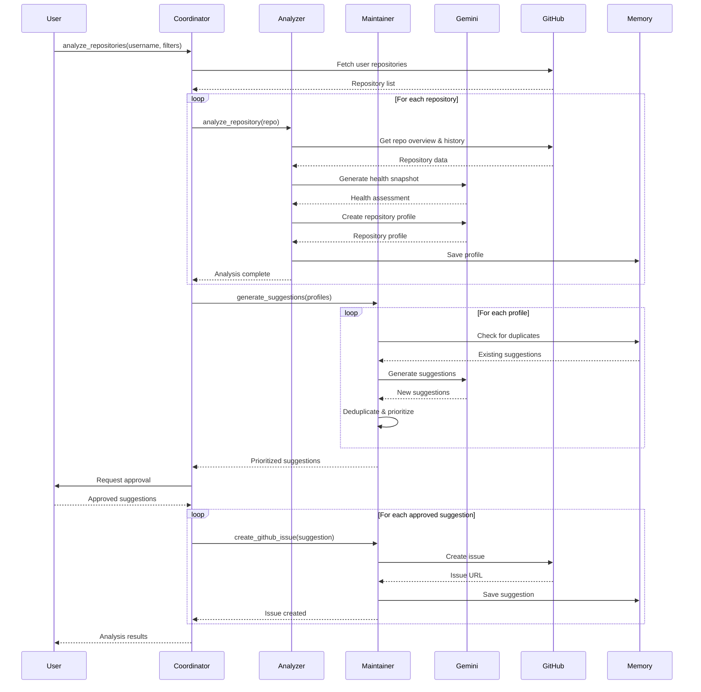
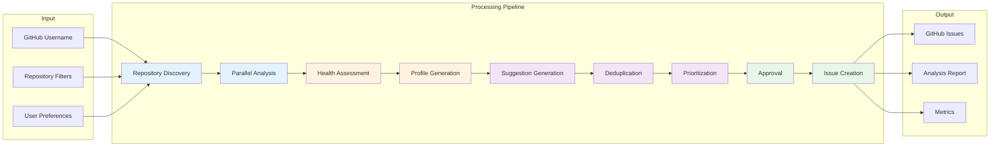
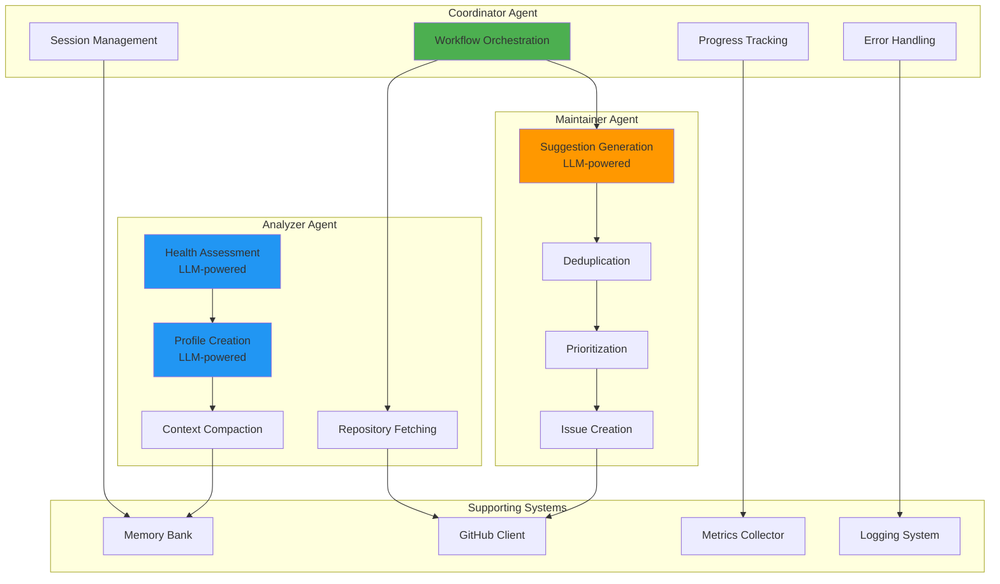
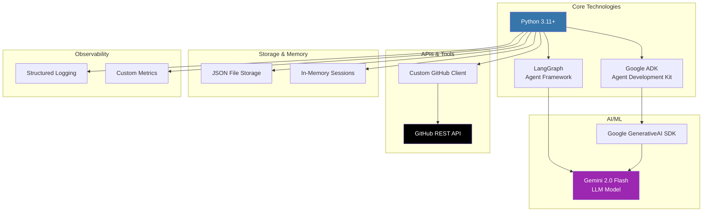
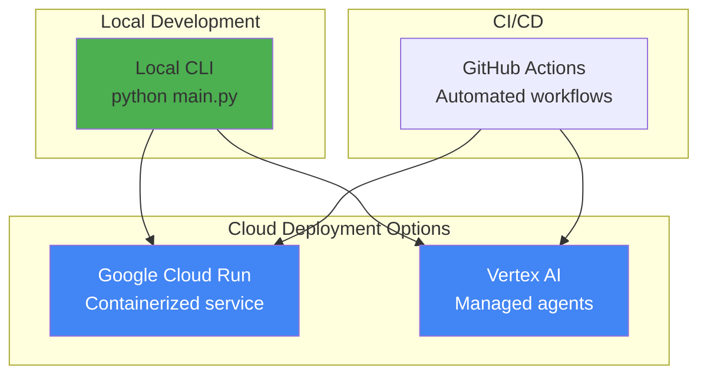

# Penguin AI Agent - Architecture Diagrams

## System Architecture

## Agent Workflow

## Data Flow Architecture

## Multi-Agent System Components

## Technology Stack

## Key Features Implementation

| Feature | Implementation | Agent Responsible |
|---------|---------------|-------------------|
| Multi-Agent System | LangGraph + Google ADK | Coordinator |
| Repository Analysis | GitHub API + LLM reasoning | Analyzer |
| Health Assessment | Gemini-powered evaluation | Analyzer |
| Smart Suggestions | LLM-generated recommendations | Maintainer |
| Memory & Deduplication | JSON-based Memory Bank | Maintainer |
| Session Management | InMemorySessionService | Coordinator |
| Observability | Structured logging + metrics | All agents |
| Context Engineering | Token-aware compaction | Analyzer |
| Parallel Processing | ThreadPoolExecutor | Analyzer |
| Issue Automation | GitHub API integration | Maintainer |

## Deployment Options

