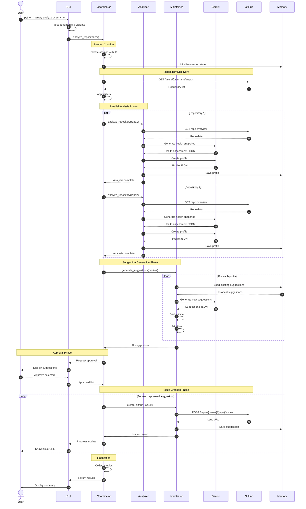
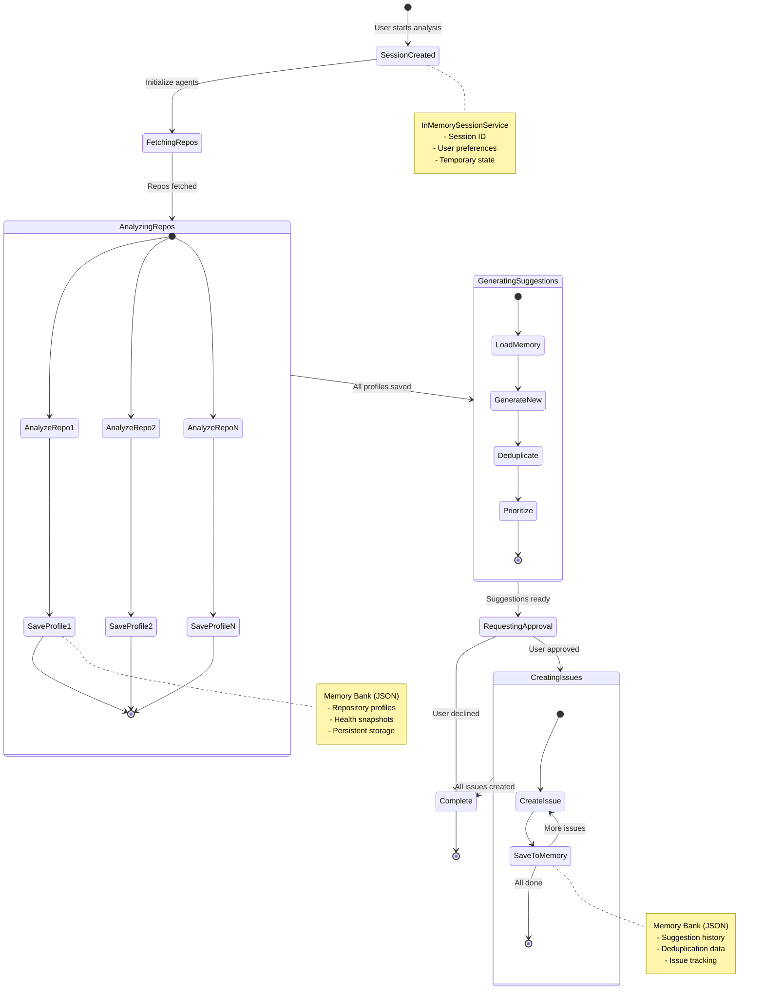
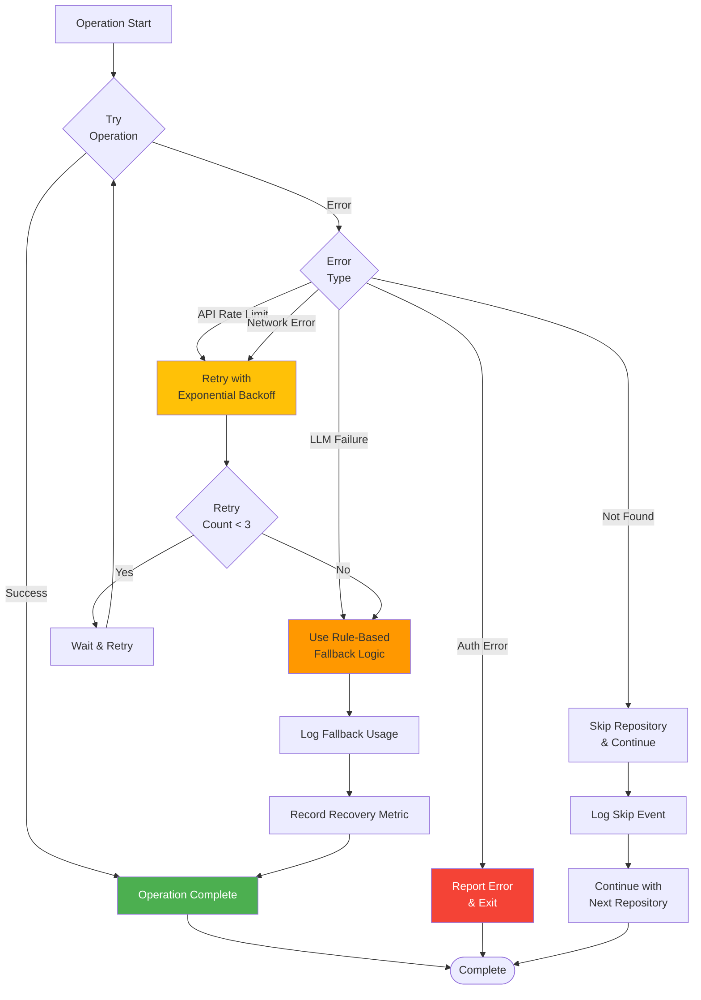
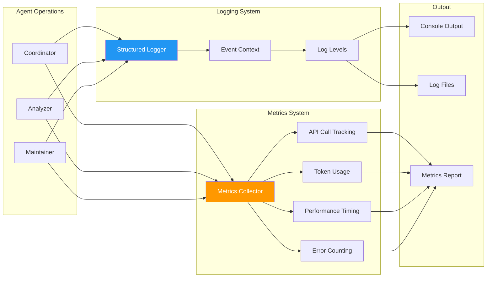
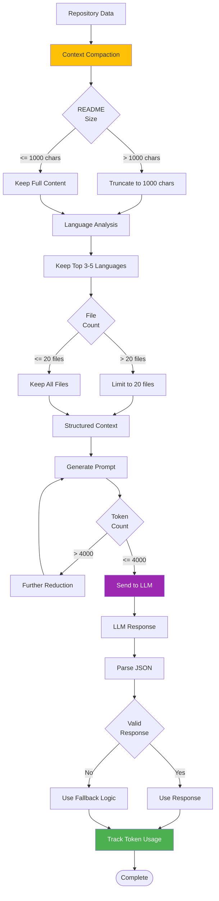
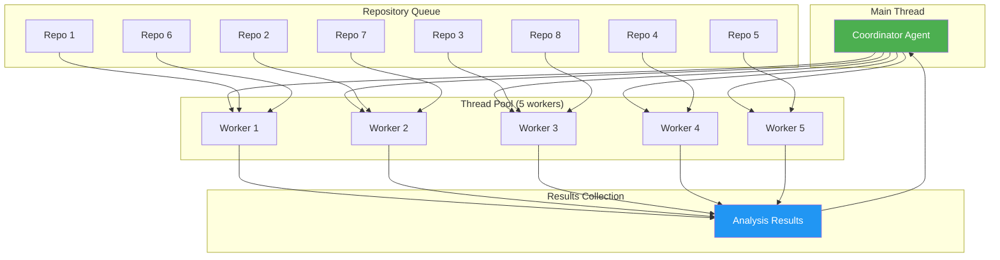

# Penguin AI Agent - Working Flow Diagrams

## Complete System Flow

```mermaid
flowchart TD
    START([User Starts Analysis]) --> INPUT[Provide GitHub Username<br/>+ Filters + Preferences]
    
    INPUT --> INIT[Initialize System]
    INIT --> VALIDATE{Validate<br/>Credentials}
    
    VALIDATE -->|Invalid| ERROR1[Show Error Message]
    ERROR1 --> END1([Exit])
    
    VALIDATE -->|Valid| CREATE_AGENTS[Create Agent Instances<br/>Coordinator, Analyzer, Maintainer]
    
    CREATE_AGENTS --> FETCH[Fetch User Repositories<br/>from GitHub API]
    
    FETCH --> FILTER{Apply<br/>Filters?}
    FILTER -->|Yes| APPLY_FILTER[Filter by Language,<br/>Date, Visibility]
    FILTER -->|No| REPO_LIST[Repository List]
    APPLY_FILTER --> REPO_LIST
    
    REPO_LIST --> PARALLEL{Parallel<br/>Analysis}
    
    PARALLEL --> ANALYZE1[Analyze Repo 1]
    PARALLEL --> ANALYZE2[Analyze Repo 2]
    PARALLEL --> ANALYZE3[Analyze Repo N]
    
    ANALYZE1 --> HEALTH1[Generate Health Snapshot<br/>using Gemini LLM]
    ANALYZE2 --> HEALTH2[Generate Health Snapshot<br/>using Gemini LLM]
    ANALYZE3 --> HEALTH3[Generate Health Snapshot<br/>using Gemini LLM]
    
    HEALTH1 --> PROFILE1[Create Repository Profile<br/>using Gemini LLM]
    HEALTH2 --> PROFILE2[Create Repository Profile<br/>using Gemini LLM]
    HEALTH3 --> PROFILE3[Create Repository Profile<br/>using Gemini LLM]
    
    PROFILE1 --> SAVE1[Save to Memory Bank]
    PROFILE2 --> SAVE2[Save to Memory Bank]
    PROFILE3 --> SAVE3[Save to Memory Bank]
    
    SAVE1 --> COLLECT[Collect All Profiles]
    SAVE2 --> COLLECT
    SAVE3 --> COLLECT
    
    COLLECT --> GEN_SUGG[Generate Suggestions<br/>using Gemini LLM]
    
    GEN_SUGG --> DEDUP[Deduplicate Against<br/>Memory Bank]
    
    DEDUP --> PRIORITIZE[Prioritize by Impact<br/>& Effort]
    
    PRIORITIZE --> APPROVAL{Request<br/>Approval}
    
    APPROVAL -->|Auto Mode| AUTO_APPROVE[Auto-approve All]
    APPROVAL -->|Manual Mode| SHOW_SUGG[Display Suggestions<br/>to User]
    
    SHOW_SUGG --> USER_CHOICE{User<br/>Choice}
    USER_CHOICE -->|Approve All| APPROVED_ALL[All Suggestions]
    USER_CHOICE -->|Select Some| APPROVED_SOME[Selected Suggestions]
    USER_CHOICE -->|Approve None| APPROVED_NONE[No Suggestions]
    USER_CHOICE -->|Quit| END2([Exit])
    
    AUTO_APPROVE --> CREATE_ISSUES
    APPROVED_ALL --> CREATE_ISSUES
    APPROVED_SOME --> CREATE_ISSUES
    APPROVED_NONE --> RESULTS
    
    CREATE_ISSUES[Create GitHub Issues] --> ISSUE_LOOP{More<br/>Issues?}
    
    ISSUE_LOOP -->|Yes| CREATE_ONE[Create Issue via<br/>GitHub API]
    CREATE_ONE --> SAVE_SUGG[Save Suggestion<br/>to Memory]
    SAVE_SUGG --> ISSUE_LOOP
    
    ISSUE_LOOP -->|No| RESULTS[Display Results<br/>& Metrics]
    
    RESULTS --> END3([Complete])
    
    style START fill:#4CAF50,color:#fff
    style CREATE_AGENTS fill:#2196F3,color:#fff
    style HEALTH1 fill:#9C27B0,color:#fff
    style HEALTH2 fill:#9C27B0,color:#fff
    style HEALTH3 fill:#9C27B0,color:#fff
    style GEN_SUGG fill:#9C27B0,color:#fff
    style CREATE_ISSUES fill:#FF9800,color:#fff
    style END3 fill:#4CAF50,color:#fff
```

## Agent Interaction Flow

## Data Processing Pipeline

```mermaid
flowchart LR
    subgraph "Input Stage"
        A1[GitHub Username]
        A2[Repository Filters]
        A3[User Preferences]
    end
    
    subgraph "Discovery Stage"
        B1[Fetch Repositories]
        B2[Apply Filters]
        B3[Repository List]
    end
    
    subgraph "Analysis Stage"
        C1[Fetch Repo Data]
        C2[LLM Health Assessment]
        C3[LLM Profile Generation]
        C4[Context Compaction]
    end
    
    subgraph "Suggestion Stage"
        D1[Load Memory]
        D2[LLM Suggestion Generation]
        D3[Deduplication]
        D4[Prioritization]
    end
    
    subgraph "Approval Stage"
        E1[Display to User]
        E2[User Selection]
        E3[Approved List]
    end
    
    subgraph "Execution Stage"
        F1[Create GitHub Issues]
        F2[Save to Memory]
        F3[Track Metrics]
    end
    
    subgraph "Output Stage"
        G1[Issue URLs]
        G2[Analysis Report]
        G3[Performance Metrics]
    end
    
    A1 --> B1
    A2 --> B2
    A3 --> B2
    B1 --> B2
    B2 --> B3
    
    B3 --> C1
    C1 --> C2
    C2 --> C3
    C3 --> C4
    
    C4 --> D1
    D1 --> D2
    D2 --> D3
    D3 --> D4
    
    D4 --> E1
    E1 --> E2
    E2 --> E3
    
    E3 --> F1
    F1 --> F2
    F2 --> F3
    
    F1 --> G1
    F3 --> G2
    F3 --> G3
    
    style C2 fill:#9C27B0,color:#fff
    style C3 fill:#9C27B0,color:#fff
    style D2 fill:#9C27B0,color:#fff
```

## Memory & State Management

## Error Handling & Fallback Flow

## Observability & Monitoring Flow

## Token Usage & Cost Optimization

## Parallel Processing Architecture

